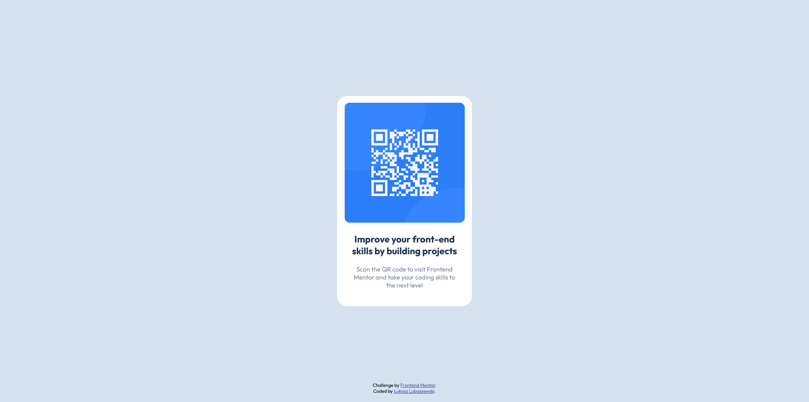

# Frontend Mentor - QR code component solution

This is a solution to the [QR code component challenge on Frontend Mentor](https://www.frontendmentor.io/challenges/qr-code-component-iux_sIO_H). Frontend Mentor challenges help you improve your coding skills by building realistic projects. 

## Table of contents

- [Frontend Mentor - QR code component solution](#frontend-mentor---qr-code-component-solution)
  - [Table of contents](#table-of-contents)
  - [Overview](#overview)
    - [Screenshot](#screenshot)
    - [Links](#links)
  - [My process](#my-process)
    - [Built with](#built-with)
    - [What I learned](#what-i-learned)
  - [Author](#author)

## Overview

### Screenshot

### Links

- Solution URL: [Add solution URL here](https://your-solution-url.com)
- Live Site URL: [Add live site URL here](https://your-live-site-url.com)

## My process

### Built with

- Semantic HTML5 markup
- SCSS custom properties
- Flexbox
- Desktop-first workflow
- [SCSS](https://sass-lang.com/) - SCSS

### What I learned

I haven't really learned anything new in this challenge but would like to leave a note to myself that I finished this design in about an hour in the span of two days. I would like to excercise my speed in making these.

## Author

- Github - [Łukasz Lubaszewski](https://github.com/luckyszakul0)
- Frontend Mentor - [@Lukasz710](https://www.frontendmentor.io/profile/Lukasz710)
